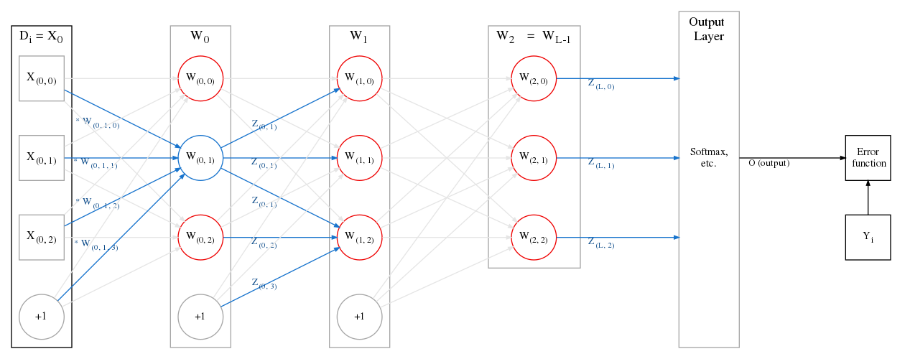

# Notation and terminology for basic feedforward networks

When you deal with feedforward networks, it is easy to lose track of which exact neuron or layer is being referred to at a particular point in time.

For that reason, I use the following terminology and notation:

- I will use zero-indexing everywhere, as that makes things easier to translate into code.
- The network is split into $L$ layers, $W_0, W_1, \dots, W_i, \dots, W_{L-1}$. These are all **hidden** layers.
    - The main property of a layer is that it has trainable weights attached to it: each neuron "owns" the weights that are fed into the affine function while calculating its output.
    - The input vector/tensor to the network is not considered a "layer". Neither is the output vector/tensor.

- $X_i$ or $x_i$ (used interchangeably) are inputs to a layer $W_i$. 
    - These inputs may be vectors/tensors, depending on the problem.
    - The input to the first layer is $X_0$, which selected from the dataset $D$.

- The output from the $i^{th}$ neuron of the $j^{th}$ layer is $Z_{(i,j)}$ or $z_{(i,j)}$ (used interchangeably). 
    - This output is obtained after we compute the affine function and pass that value through an activation function.
        - When required, we will denote the value of just the affine computation of a particular neuron as $A_{(i,j)}$ or $a_{(i,j)}$. Other sources might refer to this as $net_{(i,j)}$.
    - Combining the output of all neurons in layer $i$ into a vector/tensor of outputs, we get $Z_i$ or $z_i$. This will be fed to the next layer.
    - Since we are dealing with purely feed-forward networks here, we have $X_{i+1} == [\begin{matrix} Z_{i}, & \textnormal{bias} \end{matrix}]$, i.e. the input to a particular layer is _only_ the output of the previous layer, with an appended bias neuron. 
        - In other kinds of networks (e.g. recurrent), the input to a layer might also be the layer's own output in a previous time step.

- After the final hidden layer, there is another layer which calculates the output/prediction of the entire network. This shall be called the "output" layer, similar to how the input of the network is called the "input" layer.
    - This is the layer which takes as input $Z_{L-1}$ (the output of the final hidden layer) and calculates the output/prediction of the network. 
    - What this layer does is problem-specific E.g. for multi-class classification, this layer might be the softmax operation.
    - This layer does not "own" any weights. It is a "virtual" layer, like the input layer.
    - The output from this layer (and thus the output/prediction of the network) is denoted as $O$. This might be a vector/scalar, depending on the problem.
    - $Z_{L-1}$, the output of the final hidden layer, must be transformed to create the network output $O$.

- While training, we provide a dataset $D$. The network's job is to fit the dataset well. 
    - We will assume this dataset has $N$ samples.
    - Each sample in this dataset is an input-output pair, denoted ($D_i$, $Y_i$) or ($d_i$, $y_i$)
        - $D_i$ (the input) might be a vector/tensor.
            - We use this notation just to clarify the context in which different samples are being discussed. 
        - E.g. when talking about how a given example propagates through the network, $D_i$ becomes $X_0$, i.e. the input to the first layer, $W_0$. The output of $W_0$ is the vector/tensor $Z_0$, which becomes $X_1$ the input to layer $W_1$.
        - $Y_i$ is usally a single value, but this depdends on the problem.
            - E.g. for multi-label classification, $Y_i$ might be a vector of ones and zeros, representing which classes the input $D_i$ belongs to.
            - The dimensions of $Y_i$ will be the same as $O$, the output of the network when being input $D_i$. Together, $Y_i$ at $O$ will be fed into the error function to calculate the error value.

    - If we are going to split the dataset into mini-batches for training (i.e. _batched gradient descent_), $B$ will denote the batch size. 
        - Generally $B \lt\lt N$, e.g. we have a dataset of 1 million images, but we train in batches of 128 at a time.
        - When we run over the entire dataset once (i.e. we have trained using $\frac{N}{B}$ batches), it is called an _epoch_.
    - If we have a multi-class classification problem (e.g. identifying if a given photo is of a cat, dog, giraffe, zebra, orangutan, etc.), we assume that there are $K$ such output classes. 
        - You might also hear that there are $K$ "target classes" or "output categories".
        - The output layer should be structured to narrow down to one/multiple of these $K$ classes.

- During training, we compute the value of the _Error function_. This is logically after the Output layer. 
    - It takes as input $O$, the output of the network when fed $D_i$, and $Y_i$, the actual output value. 
    - The error value is a scalar.

## By example

Take a look at the network in Fig 1. We can see that: 
- L = 3 i.e. there are three (hidden) layers.
- The input to the network, $D_i$, is a vector of with 3 features. When combined with a bias unit, it becomes $X_0$, as it is fed into each neuron of the first hidden layer $W_0$.
    - Each neuron owns a vector of weights which it uses to produce the output. In the figure above, we look at the second neuron of $W_0$, i.e. $W_{(0, 1)}$, with weight vector $[ \begin{matrix} W_{(0, 1, 0)} & W_{(0, 1, 1)} & W_{(0, 1, 2)} & W_{(0, 1, 3)} \end{matrix}]$. The neuron "owns" these weights; it can be considered part of its definition.
    - This weight vector is multiplied by the corresponding input vector to the layer. Here, it is $X_0 = [ \begin{matrix} X_{(0,0)} & X_{(0,1)} & X_{(0,2)} & X_{(0,3)} \end{matrix}]$.
    - For a neuron $W_{(0,1)}$, the affine function computes $A_{(0,1)} = X_0 \cdot W_{(0,1)}$ (the bias is already included). This is a scalar for a particular neuron.
    - Each neuron in the above figure outputs a single, scalar value. For our selected neuron, it is $Z_{(0,1)} = activation(A_{(0,1)})$, where the activation function might be sigmoid, ReLU, tanh, etc.
    - The vector of outputs from a particular layer is combined with a bias and becomes the next layer's input. In our example, it is $ X_{1} = [ \begin{matrix} Z_{0}, & bias ] \end{matrix}  = [ \begin{matrix} Z_{(0,0)} & Z_{(0,1)} & Z_{(0,2)} & bias \end{matrix} ] $.
- Same goes for layers $W_1, W_2, etc$.
- The final layer $W_{L-1}$ calculates and propagates $Z_{L-1}$ to the output layer. The output layer does **not** take a bias unit as input.