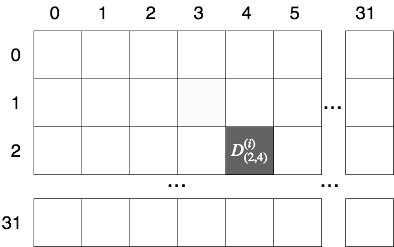
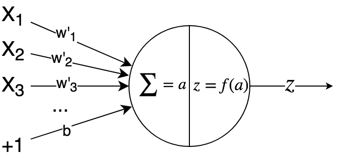
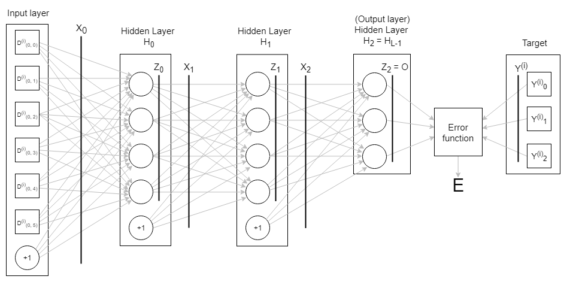
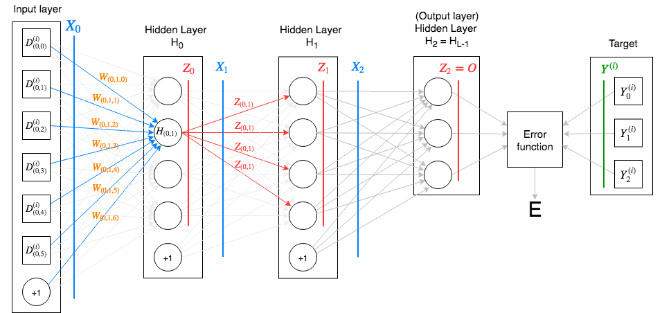

# Notation and terminology for feedforward networks

## Notation and terminology

When you deal with neural networks, it is easy to lose track of which exact neuron or layer is being referred to in the discussion. For this reason, I use the notation described in the sections below, which is hopefully unambiguous.

### Indexing

I will use zero-indexing everywhere, as it makes things easier to translate into code.

### Dataset and batches

While training the network weights, we provide a dataset $$D$$.

The network's job is to fit the dataset well and reduce the error on training samples.

* The dataset has $$N$$ samples.
* Each sample in this dataset is an input-output pair, denoted \($$D^{(i)}$$, $$Y^{(i)}$$\) or \($$d^{(i)}$$, $$y^{(i)}$$\)
  * $$D^{(i)}$$ \(the input part of the $$i^{th}$$ sample\) is a vector/tensor.
    * The parenthesis in the superscript is to help us differentiate this from the "$$i^{th}$$ power" notation. If we want to index certain components of the input, we will use the subscript notation. 
    * E.g. if our dataset consists of black-and-white images, each of which is 32x32 pixels across, and where each pixel takes is a grey value between 0 and 127, then we can represent each sample's input as a 32x32 matrix of variables, i.e. $$D^{(i)} \in \mathbb{R}^{(32, 32)}$$. If we want the grey value at the $$3^{th}$$ row and $$5^{th}$$ column of the $$9^{th}$$ image, we would index it as: $$D^{(8)}_{(2, 4)}$$ \(remember, we use zero-indexing\).

* $$Y^{(i)}$$ is the output part of the $$i^{th}$$ sample. It is also known as the _target_ or the _ground truth value_.
  * For regression problems, $$Y_{(i)}$$ will be a scalar. E.g. if we are performing housing-price prediction, $$Y^{(10)} = 598$$ might mean that the price of the $$11^{th}$$ house is $598,000.
  * For classification problems, $$Y^{(i)}$$ will belong to one \(or more\) of $$K$$ _classes_ or _labels_. E.g. for single-label image classification, $$Y^{(7)} = Cat$$ means that the $$8^{th}$$ image is actually a cat. Whereas if our problem is multi-label classification, we might have $$Y^{(31)} = \begin{matrix} \{Cat, & Dog, & Horse\} \end{matrix}$$, meaning our sample actually contains a cat, dog and a horse.

    * During classification, an important representation of each target variable is _one-hot encoding_. In this representation, we assign each of the $$K$$ possible classes to index of a vector, and every target thus becomes a vector of ones and zeros, depending on whether that class is present in the sample or not.

    E.g. Suppose we have a multi-label image classification problem, where we have the classes $$\begin{matrix} \{Bear, & Cat, & Dog, & Goose, & Horse, & Mouse, & Zebra\} \end{matrix}$$ $$(K = 7)$$. For each class which is present, we set the value of 1 in its respective index in this array. Following this procedure, the above two targets become:

    $$
    Y^{(7)} = Cat 
        = \left[ \begin{matrix} 
          0 \\
          1 \\
          0 \\
          0 \\
          0 \\
          0 \\
          0 
        \end{matrix} \right]
        \\
        Y^{(31)} = \begin{matrix} \{Cat, & Dog, & Horse\} \end{matrix} 
        = \left[ \begin{matrix} 
          0 \\
          1 \\
          1 \\
          0 \\
          1 \\
          0 \\ 
          0 
        \end{matrix} \right]
    $$
* If we are going to split the dataset into _batches_ for training \(as in the case of _batched gradient descent_\), we will let $$B$$ will denote the batch size.
  * Generally $$B \lt\lt N$$, e.g. we have a dataset of 1 million samples, but we train in batches of 128 at a time.
  * Every time we train over the entire dataset \(i.e. we train using $$\frac{N}{B}$$ batches\), it is called an _epoch_.
  * **Note:** the network performs the same computation on each sample in the batch. Thus, most network-level operations \(prediction, feedforward, backpropagation, etc\) can be run in parallel over the samples in a batch.

### Network terminology

#### Neurons

The most vanilla form of a neural network is a sequence of layers, each of which is a stack of neurons. A neuron is the basic unit of computation in a neural network.

We say that neuron "owns" a vector of weights. It takes as input a vector from the previous layer, along with a linear bias, and computes the dot product of these two vectors \(this operation is called an _affine transform_\). This scalar affine value is then transformed by a non-linear _activation function_ \(denoted $$f(x)$$\) to obtain another scalar value, which is the neuron's output.

Let's do this mathematically. The affine value is:

$$
a = w' \cdot X + b = \left(\sum_{i=0}^{n-1}(w'_i \cdot X_i) \right) + b
$$

and the neuron output is:

$$
z = f(a)
$$

Where:

* $$X$$ = input vector to neuron \(this comes from the previous layer\).
* $$w'$$ = weight vector of neuron.
* $$b$$ = bias unit value \(this value is learnt during training\).
* $$f$$ = the activation function. E.g. sigmoid, tanh, ReLU, etc.

During training, we learn the values of the vector $$w'$$ and the scalar $$b$$ together, so we usually concatenate them into a single vector: $$w = [\begin{matrix} w',& b \end{matrix}]$$. Going forward, I will use $$w$$ to mean this concatenated vector.

#### Hidden layers

* The network comprises of $$L$$ _hidden layers_: $$H_0 , H_1 , \dots , H_l, \dots , H_{L-1}$$.
* Each layer is made up of a stack of _neurons_.
  * The $$l^{th}$$ layer will have $$|H_l|$$ neurons in it.
  * The smallest possible network has just one hidden layer, with one neuron in it.
* The main property of a hidden layer is that it has trainable _weights_ attached to it. We will denote these weights as $$W_0 , W_1 , \dots , W_l , \dots W_{L-1}$$.
  * Remember, each neuron in the layer is said to "own" the weights that are used to calculate its affine value and the neuron output.
* **Note**: when we say "a layer" \(versus "the input layer"\), we mean a hidden layer.
* **Note**: The input vector/tensor to the network is not considered a "hidden layer". Neither is the output vector/tensor. These two are both ephemeral; they have no trainable weights attached to them. The hidden layers are the only "solid" layers; if you had to export a network to disk for later use, you would only have to serialize the network structure, and the weights owned by each hidden layer. 

#### Layer inputs

Remember: we draw samples from the dataset $$D$$ and feed them into network for training/prediction. Each sample is an input-target pair $$(D^{(i)}, Y^{(i)})$$.

We might also feed the network batches of $$B > 1$$ samples at a time:

$$
\left[ \begin{matrix}
    D^{(i)}, & Y^{(i)} \\
    D^{(i+1)}, & Y^{(i+1)} \\
    \dots & \dots \\
    D^{(i+B-1)}, & Y^{(i+B-1)}
  \end{matrix} \right]
$$

Regardless of whether we feed a single sample or a batch, we will use $$X_l$$ or $$x_l$$ to denote the inputs to a layer $$H_l$$. We will rely on the context to tell us the dimensionality of $$X_l$$.

* Thus, the input to the first layer will be $$X_0 = \begin{matrix} D^{(i)}, & +1 \end{matrix}$$. 
* For subsequent layers, the layer inputs are $$X_1, X_2, \dots, X_{L-1}$$.

#### Layer outputs

As mentioned, each neuron uses the layer input and its own weights to calculate the affine value, which it then passes through a non-linear activation function to create the neuron output.

* We will denote the output from the $$j^{th}$$ neuron of the $$l^{th}$$ layer as $$Z_{(l, j)}$$ or $$z_{(l, j)}$$.
* When required, we will denote the value of just the affine computation of the corresponding neuron as $$A_{(l, j)}$$ or $$a_{(l, j)}$$. Other sources might refer to this as $$net_{(l, j)}$$.

Grouping the outputs of all neurons in a layer, we get the _layer output_, which is a vector $$Z_l \in \mathbb{R}^{|H_{l}|}$$.

Note:

* For simple, dense networks, the output of each hidden layer \(along with a bias value\) becomes the input to the next later. 

  i.e. $$X_{l+1} = [\begin{matrix} Z_{l}, & +1 \end{matrix}]$$. The comma here means we concatenate the vector $$Z_l$$ with the scalar bias value \(which is usually +1\) to create a new vector, which we feed into the subsequent layer.

* In the case of recurrent networks, the input of each layer is not only the output of the previous layer in the network, but also the output of the _same_ layer in the previous time step \(i.e. for the previous sample $$D^{(i-1)}$$\).

#### Final \("output"\) layer and network output

The final hidden layer of a network is frequently referred to as the "output" layer of the network.

**This is very different from the network output!** The output layer _produces_ the network output, i.e. when we use the network to train/predict, the output layer tells us what the network predicts for a particular sample's input, $$D^{(i)}$$.

We will denote the output layer as $$H_{L-1}$$ and the network output as $$O$$. As the output layer is the final hidden layer, we have $$O = Z_{L-1}$$.

Some important points:

* The network output $$O$$ does **not** have the bias value +1 concatenated to it. This is because the output layer is the final layer, and there are no trainable weights "after" it.
* In general, when we design basic \(dense\) networks, we maintain the same number of neurons in each hidden layer. The output layer is the exception to this rule: the network output $$O$$ must have the same dimensions as the sample's target, $$Y^{(i)}$$. This is because both of these will be fed into the _Error function_, which computes how much they differ from each other. 
  * If we have a regression problem, $$O, Y^{(i)} \in \mathbb{R}$$ i.e. both are scalars.
  * If we have a classification problem and we using one-hot encoding to obtain a vector $$Y^{(i)}$$, then $$O, Y^{(i)} \in \mathbb{R}^K$$, where $$K$$ is the number of classes.

#### Error function

The _Error function_, also called the _Loss function_ or _Cost function_, tells us how much the network's prediction differs from the sample's actual target. That is, it tells us how much $$O$$ and $$Y^{(i)}$$ differ.

We denote the Error function by $$E(O, Y^{(i)})$$, or just $$E$$ for short.

The Error function always outputs a **scalar** i.e. $$E \in \mathbb{R}$$. The neural network training algorithm \(gradient descent etc.\) attempts to iteratively tweak the weights, so as to minimize the error value predicted for the training dataset.

Some common error functions are _Mean-squared error_ and _Categorical cross-entropy_.

### Example usage of notation and terminology

Let's go apply what we have just learned to the figure above.

We see that:

* $$L = 3$$ i.e. there are three \(hidden\) layers.
* $$Y^{(i)} \in \mathbb{R}^3$$, i.e. we have $$K=3$$ output classes.
* The input to the network, $$D^{(i)}$$, is a vector with 6 features, i.e. $$D^{(i)} \in \mathbb{R}^{6}$$. When combined with a bias value +1, this becomes $$X_0 \in \mathbb{R}^{7}$$. This is the input vector that is fed into each neuron of the first hidden layer $$H_0$$.

  $$
  X_0 = 
    \left[ \begin{matrix} 
      D_{(0,0)} & 
      D_{(0,1)} & 
      D_{(0,2)} & 
      D_{(0,3)} & 
      D_{(0,4)} & 
      D_{(0,5)} & 
      +1
    \end{matrix} \right]
  $$

* Each neuron in the network owns a vector of weights, which it uses to produce the output. In the figure above, we consider $$H_{(0, 1)}$$, i.e. the second neuron of $$H_0$$. This neuron owns the following weight vector: 

  $$
  W_{(0, 1)} = 
    \left[ \begin{matrix} 
      W_{(0, 1, 0)} \\
      W_{(0, 1, 1)} \\
      W_{(0, 1, 2)} \\
      W_{(0, 1, 3)} \\
      W_{(0, 1, 4)} \\
      W_{(0, 1, 5)} \\
      W_{(0, 1, 6)} 
    \end{matrix} \right]
  $$

  * Taking the dot product of the input vector and the weight vector \(not shown in the figure\), we obtain the affine value $$A_{(0,1)} = X_0 \cdot W_{(0,1)}$$. Passing this through the activation function, we get the corresponding neuron output, $$Z_{(0,1)} = f(A_{(0,1)})$$. This is sent to all neurons in the subsequent layer.
  * Note that $$A_{(0,1)} \in \mathbb{R}$$ and $$Z_{(0,1)} \in \mathbb{R}$$, i.e. both are scalars.

* $$Z_0$$, the vector of outputs of all neurons in the first layer $$H_0$$, is combined with a bias value +1 and becomes the next layer's input. From the example above: $$X_{1} = [ \begin{matrix} Z_{0}, & +1 ] \end{matrix}  = [ \begin{matrix} Z_{(0,0)} & Z_{(0,1)} & Z_{(0,2)} & Z_{(0,3)} & +1 \end{matrix} ]$$.
* We follow a similar process for layers $$H_1$$ and $$H_2$$. 
* The output layer $$H_2$$ calculates the network output $$Z_{2} = O$$, which is consumed by the error function, along with the one-hot encoded target vector, $$Y^{(i)}$$. This produces the error value $$E$$ for the sample $$(D^{(i)}, Y^{(i)})$$.

