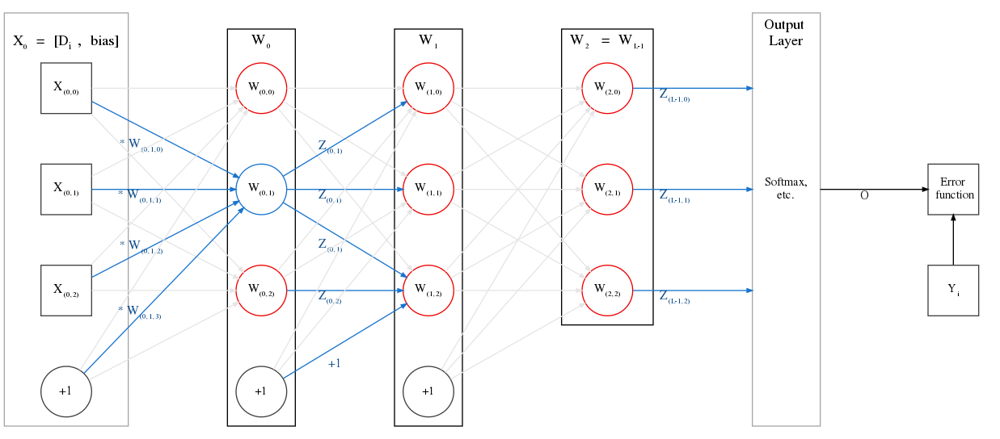

# Notation and terminology for feedforward networks

## Notation and terminology

When you deal with feedforward networks, it is easy to lose track of which exact neuron or layer is being referred to at a particular point in time. For this reason, I use the terminology and notation described in the sections below, which is hopefully unambiguous.

### Indexing

I will use zero-indexing everywhere, as it makes things easier to translate into code.

### Dataset and batches

While training the network weights, we provide a dataset $$D$$. 

The network's job is to fit the dataset well and reduce the error on training samples.

- The dataset has $$N = |D|$$ samples: $$D^{(0)} , D^{(1)} , D^{(2)} , \dots , D^{(i)} , \dots , D^{(N-1)}$$. The parenthesis in the superscript is to help us differentiate this from the "$$i^{th}$$ power" notation.
- Each sample in this dataset is an input-output pair, denoted ($$X^{(i)}$$, $$Y^{(i)}$$) or \($$x^(i)$$, $$y^(i)$$\)
  - $$X^{(i)}$$ (the $$i^{th}$$ input) is a vector/tensor.
  - $$Y^{(i)}$$ (the $$i^{th}$$ output or _target_) is usually a scalar value.
    - For classification problems, $$Y_{(i)}$$ will belong to one (or more) of $$K$$ _classes_ or _labels_. E.g. for single-label image classification, $$Y^{(7)} = Cat$$ means that the $$8^{th}$$ image is actually a cat. Whereas if our problem is multi-label classification, we might have $$Y^{(31)} = \begin{matrix} \{Cat, & Dog, & Horse\} \end{matrix}$$, meaning our sample actually contains a cat, dog and a horse.
    - An important representation of each target variable is _one-hot encoding_. 
      - In this representation, we assign each of the $$K$$ possible classes to index of a vector, and every target thus becomes a vector of ones and zeros, depending on whether that class is present in the sample or not.
      - E.g. Suppose we have a multi-label image classification problem, where we have the classes $$\begin{matrix} \{Bear, & Cat, & Dog, & Goose, & Horse, & Mouse, & Zebra\} \end{matrix}$$ $$(K = 7)$$. Each class is assigned its respective index in this array, and the above two targets become:
        $$
          Y^{(7)} = Cat 
          = \left[ \begin{matrix} 
            0 &
            1 &
            0 &
            0 &
            0 &
            0 &
            0 
          \end{matrix} \right]
          \\
          Y^{(31)} = \begin{matrix} \{Cat, & Dog, & Horse\} \end{matrix}
          = \left[ \begin{matrix} 
            0 & 
            1 & 
            1 & 
            0 & 
            1 & 
            0 & 
            0 
          \end{matrix} \right]
        $$  

- If we are going to split the dataset into _batches_ for training (as in the case of _batched gradient descent_), we will let $$B$$ will denote the batch size.
  - Generally $$B \lt\lt N$$, e.g. we have a dataset of 1 million images, but we train in batches of 128 at a time.
  - Every time we train over the entire dataset \(i.e. we train using $$\frac{N}{B}$$ batches\), it is called an _epoch_.
  - **Note:** the network performs the same computation over each sample in the batch. Thus, most network-level operations (prediction, feedforward, backpropagation, etc) can be run in parallel over a batch.

### Network terminology

#### Hidden layers

- The network comprises of $$L$$ _hidden layers_: $$H_0 , H_1 , \dots , H_l, \dots , H_{L-1}$$.
- Each layer is made up of _neurons_ which are the basic units of computation in a neural network.
  - The $$l^{th}$$ layer will have $$|H_l|$$ neurons in it.
  - The smallest possible network has just one hidden layer, with one neuron in it.
- The main property of a hidden layer is that it has trainable _weights_ attached to it. We will denote these weights as $$W_0 , W_1 , \dots , W_l , \dots W_{L-1}$$.
  - Each neuron in the layer is said to "own" the weights that are used to calculate the affine value and the neuron output.
- **Note**: The input vector/tensor to the network is not considered a "hidden layer". Neither is the output vector/tensor. These two layers are both ephemeral; they have no trainable weights attached to them. The hidden layers are the only "solid" layers; if you had to export a network to disk for later use, you would only have to serialize the network structure, and weights owned by the hidden layers. 
- **Note**: when we say "a layer" (versus "the input layer"), we mean a hidden layer.

#### Layer inputs

Remember: we draw samples from the dataset $$D$$ and feed them into network for training/prediction. Each sample is an input-output pair $$(X^{(i)}, Y^{(i)})$$.

We might also feed the network batches of $$B > 1$$ samples at a time:
$$
  D^{(i , i+1, \dots , i+B-1)} = 
  \left[ \begin{matrix}
    (X^{(i)}, Y^{(i)}) &
    (X^{(i+1)}, Y^{(i+1)}) &
    \dots &
    (X^{(i+B-1)}, Y^{(i+B-1)})
  \end{matrix} \right]
$$

Regardless of whether we feed a single sample or a batch, we will use $$X_l$$ or $$x_l$$ to denote the inputs to a layer $$W_l$$. The context will tell us the dimensionality of the $$X_l$$.

E.g. the input to the first layer is $$X_0 = D^{(i)}[0]$$ (I am indexing the pair here). For subsequent layers, it is $$X_1, X_2, \dots, X_{L-1}$$.

#### Layer outputs

Each neuron of a layer uses the inputs to the layer and its weights to compute the affine function, which it then passes through an _activation function_ to create the neuron output.
  - When required, we will denote the value of just the affine computation of a particular neuron as $$A_{(i,j)}$$ or $$a_{(i,j)}$$. Other sources might refer to this as $$net_{(i,j)}$$.
We will denote the output from the $$i^{th}$$ neuron of the $$l^{th}$$ layer is $$Z_{(l, i)}$$ or $$z_{(l, i)}$$.

Grouping the outputs of all neurons in a layer, we get the _layer output_ $$Z_l$$. This is a vector.

Note: 
- For simple, dense networks, the output of each hidden layer (along with a bias value) becomes the input to the next later. 
  i.e. $$X_{l+1} == [\begin{matrix} Z_{l}, & bias \end{matrix}]$$. The comma here means we concatenate the vector $$Z_l$$ with the scalar bias value (which is usually +1) to create a new vector which we feed into the subsequent layer.
- In the case of recurrent networks, the input of each layer is not only the output of the previous layer in the network, but also the output of the _same_ layer in the previous time step (i.e. for the previous sample).

#### Output (final) layer of the network

The final hidden layer of a network is frequently referred to as the "output" layer of the network. 

**This is very different from the network output!** The network's output layer _produces_ the network output, i.e. when we use the network to train/predict, the output layer tells us what the network predicts for a particular sample's input, $$X^{(i)}$$.

We will denote the output layer as $$H_{L-1}$$ and the network output as $$O$$.

The network's output must have the same dimensionality as the sample's target, $$Y^{(i)}$$. This is because both will be fed into the _Error function_ which computes how much they differ from each other.

#### Error function

The _Error function_, also called the _Loss function_ or _Cost function_, tells us how much the network's prediction differs from the sample's actual target. That is, it tells us how much $$O$$ and $$Y^{(i)}$$ differ.

We denote the Error function by $$E(O, Y^{(i)})$$, or just $$E$$ for short.

The Error function always outputs a **scalar**. The neural network training algorithm (gradient descent etc.) attempts to iteratively tweak the weights, so as to minimize the error value predicted for the training dataset.

### Example usage of notation and terminology

Take a look at the network in Fig 1. We can see that:

* L = 3 i.e. there are three \(hidden\) layers.
* The input to the network, $$D_i$$, is a vector with 3 features. When combined with a bias unit, it becomes $$X_0$$, as it is fed into each neuron of the first hidden layer $$W_0$$.
  * Each neuron owns a vector of weights which it uses to produce the output. In the figure above, we look at the second neuron of $$W_0$$, i.e. $$W_{(0, 1)}$$, with weight vector $$[ \begin{matrix} W_{(0, 1, 0)} & W_{(0, 1, 1)} & W_{(0, 1, 2)} & W_{(0, 1, 3)} \end{matrix}]$$. The neuron "owns" these weights; they can be considered part of its definition.
  * This weight vector is multiplied by the corresponding input vector to the layer. Here, it is $$X_0 = [ \begin{matrix} X_{(0,0)} & X_{(0,1)} & X_{(0,2)} & X_{(0,3)} \end{matrix}]$$.
  * For a neuron $$W_{(0,1)}$$, the affine function computes $$A_{(0,1)} = X_0 \cdot W_{(0,1)}$$ \(the bias is already included\). This is a scalar for a particular neuron.
  * Each neuron in the above figure outputs a single, scalar value. For our selected neuron, it is $$Z_{(0,1)} = activation(A_{(0,1)})$$, where the activation function might be sigmoid, ReLU, tanh, etc.
  * The vector of outputs from a particular layer is combined with a bias and becomes the next layer's input. In our example, it is $$X_{1} = [ \begin{matrix} Z_{0}, & bias ] \end{matrix}  = [ \begin{matrix} Z_{(0,0)} & Z_{(0,1)} & Z_{(0,2)} & bias \end{matrix} ]$$.
* Same goes for layers $$W_1, W_2,$$ etc. 
* The final layer $$W_{L-1}$$ calculates and propagates $$Z_{L-1}$$ to the output layer. The output layer does **not** take a bias unit as input.

