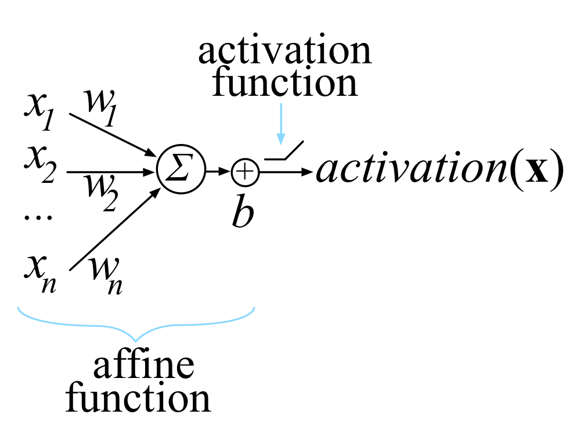

# Structure of a Feedforward Neuron

A feedforward neuron is what comes to most people's minds when they think of neural networks.

This neuron is a vector of weights. It takes as input a vector from the previous layer/input layer. It computes the dot product of these two along with a linear bias \(called an affine transform\) and then outputs a scalar value. The value it outputs is then transformed by an activation function into another scalar value, which is passed to the next layer/network output.

Let's do this mathematically:

$$
z(w, x) = w \cdot x + b
$$

Where:

$$
x = \textnormal{input vector to neuron} \\
w = \textnormal{weight vector of neuron} \\
b = \textnormal{bias unit (this value is learnt during training)}
$$

During training, we learn the values of the vectors $$w$$ and the scalar $$b$$ , so we usually concatenate them into a single vector: $$w = [w, b]$$. **Going forward, I will use** $$w$$ **to mean this concatenated vector.**

