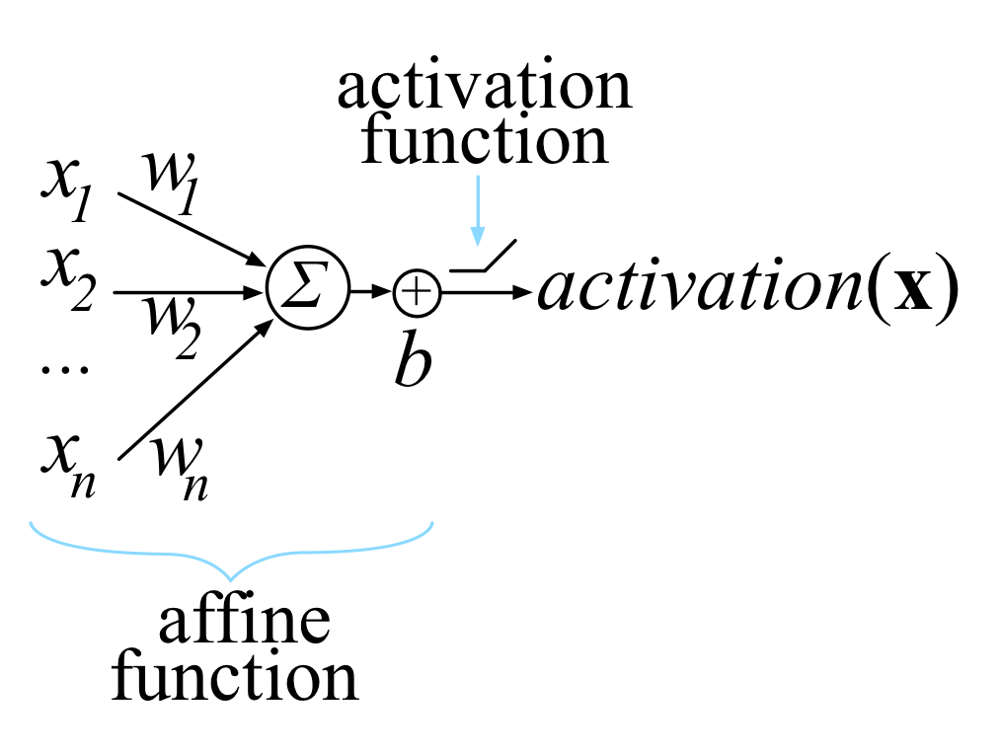

# Structure of a Feedforward Neuron

A feedforward neuron is what comes to most people's minds when they think of neural networks.

This neuron is a vector of weights. It takes as input a vector from the previous layer/input layer. It computes the dot product of these two along with a linear bias (called an affine transform) and then outputs a scalar value. The value it outputs is then transformed by an activation function into another scalar value, which is passed to the next layer/network output.

Let's do this mathematically. The affine transform is:

$$
A(w', x) = w' \cdot x + b = (\sum_{i=0}^{n-1}(w'_i \cdot x_i)) + b
$$

Where:

- $$x$$ = input vector to neuron.
- $$w'$$ = weight vector of neuron.
- $$b$$ = bias unit value (this value is learnt during training).

During training, we learn the values of the vectors $$w'$$ and the scalar $$b$$ together, so we usually concatenate them into a single vector: $$w = [\begin{matrix} w', b \end{matrix}]$$. 

**Going forward, I will use** $$w$$ **to mean this concatenated vector.**

