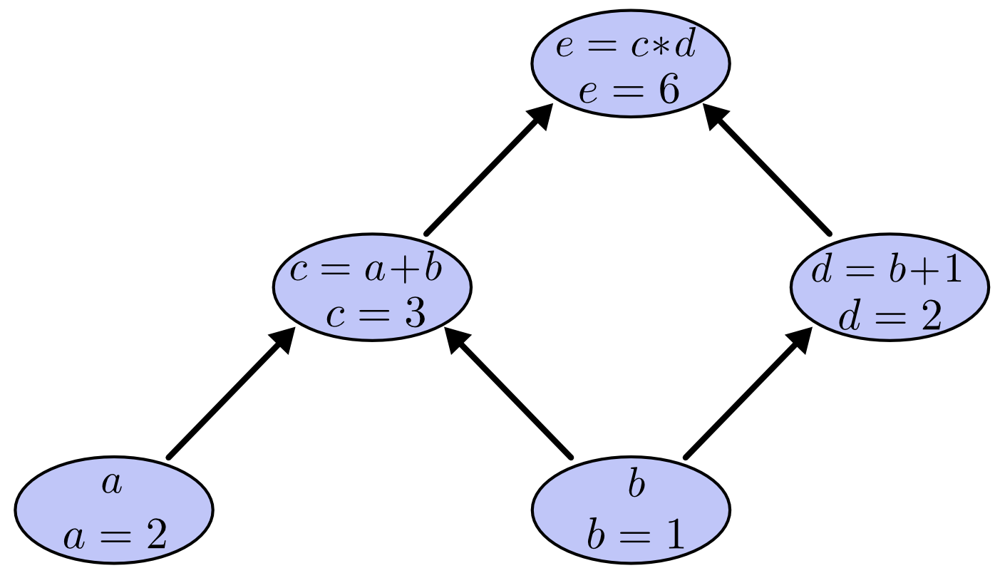
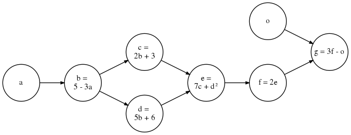
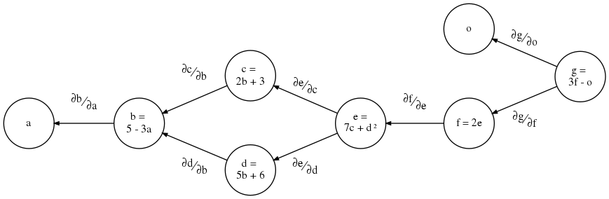

# Computational graphs and gradient flows

## Prerequisites
To best understand this article, you should know about:

- Calculus:
  - Partial derivatives.
  - [Chain rule and Multivariable Chain rule](../math/calculus/partial-derivatives/chain-rule-and-multivariable-chain-rule.html)

---

## What is a computational graph?

As [colah](http://colah.github.io/posts/2015-08-Backprop/) said quite nicely: computational graphs are a nice way to think about mathematical expressions.

For example, consider the expression $$e = (a+b) ∗ (b+1)$$. 
- There are three operations here: two additions and one multiplication. 
- To help us talk about this, let’s introduce two intermediary variables $$c$$ and $$d$$, so that every function’s output is a variable. Thus:
  - $$c = f_1(a, b) = (a + b)$$
  - $$d = f_2(b) = (b + 1)$$
  - $$e = f_3(c, d) = (c * d)$$
- To create a computational graph, we make each of these operations, along with the input variables, into nodes. When one node’s value is the input to another node, an arrow goes from one to another.

- We can evaluate the expression by setting the input variables (i.e. nodes with only outputs) to certain values and computing nodes up through the graph.
  - In the example below, if we plug $$a = 2$$ and $$b = 1$$, we get the output $$e = 6$$.

---

## Derivatives on Computational Graphs

Derivatives (also called gradients) on computational graphs are a bit more tricky to understand. I will deviate from Colah's explanation and provide multiple, more explicit examples geared towards neural networks.

You are encouraged to work through the following examples, without looking at the answer right away. Each takes about 5 minutes using a pen and paper.

### Example 1: a comprehensive Computational Graph

Consider the graph above. Here, the output is $$g = 3f - o$$, and each of the nodes calculates a function of their input, which is then passed on to the next node(s).

Now, suppose we want to calculate the partial derivative i.e. _gradient_ of the output $$g$$, with respect to each variable, i.e. we want to know: $$\frac{\partial g}{\partial g}$$, $$\frac{\partial g}{\partial o}$$, $$\frac{\partial g}{\partial f}$$, $$\frac{\partial g}{\partial e}$$, $$\frac{\partial g}{\partial d}$$, $$\frac{\partial g}{\partial c}$$, $$\frac{\partial g}{\partial b}$$, $$\frac{\partial g}{\partial a}$$

The first few are easy: 
$$
  \frac{\partial g}{\partial g} = 1 \\
  \frac{\partial g}{\partial f} = \frac{\partial (3f - o)}{\partial f} = 3 \\
  \frac{\partial g}{\partial o} = \frac{\partial (3f - o)}{\partial o} = -1
$$

However, as we move further towards the inputs of the graph, it gets more complicated:
- Let's try to compute $$\frac{\partial g}{\partial e}$$. We have:
  $$
  \frac{\partial g}{\partial e} = \frac{\partial (3f-o)}{\partial e} \\
  = \frac{\partial (3(2e)-o)}{\partial e} \\
  = \frac{\partial (6e-o)}{\partial e} = 6
  $$

- It starts to get repetitive when computing $$\frac{\partial g}{\partial d}$$:
  $$
  \frac{\partial g}{\partial d} = \frac{\partial (3f-o)}{\partial d} \\
  = \frac{\partial (3(2e)-o)}{\partial d} \\
  = \frac{\partial (6e-o)}{\partial d} \\
  = \frac{\partial (6(7c + d^2) -o)}{\partial d} \\
  = \frac{\partial (42c + 6d^2 -o)}{\partial d} \\
  = \frac{\partial (42c)}{\partial d} + \frac{\partial (6d^2)}{\partial d} - \frac{\partial (o)}{\partial d} \\
  \therefore \frac{\partial g}{\partial d} = 12d
  $$

- Notice in the example above, when we are computing $$\frac{\partial g}{\partial d}$$ from scratch, the first few steps are essentially repeated from our calculation of $$\frac{\partial g}{\partial e}$$.
  - To save effort, we can use the [chain-rule of partial derivatives](https://en.wikipedia.org/wiki/Chain_rule#Higher_dimensions) to re-use the value of $$\frac{\partial g}{\partial e}$$ which we had obtained, to calculate $$\frac{\partial g}{\partial d}$$.
    1. By chain rule, we have $$\frac{\partial g}{\partial d} = \frac{\partial g}{\partial e}\cdot \frac{\partial e}{\partial d}$$.
    1. We had already calculated $$\frac{\partial g}{\partial e} = 6$$.
    1. With a tiny bit of extra calculation: 
      $$
        \frac{\partial g}{\partial d} = 6 \left( \frac{\partial (7c + d^2)}{\partial d} \right) = 12d \\
        = 12(5b + 6) = 60b + 72 \\
        = 60(5 - 3a) + 72 = 372 - 180a
      $$
    1. Thus, $$\frac{\partial g}{\partial d} = 12d$$, the same answer we got before.

  - If the above process seems familiar to dynamic programming, it's because that's exactly what it is! We store the partial derivatives (also called "gradients") which we had computed earlier, and use those to calculate further gradient values. We can only do so while moving from the outputs to the inputs of the graph, "backwards" from the normal flow of data.

  - Note that for $$\frac{\partial g}{\partial d}$$, unlike the previous ones, we can get the answer in terms of the input $$a$$. 
      - If you have studied calculus, you might have been asked to calculate the "partial derivative of $$y$$ with respect to $$x$$, at point $$(t=0.5)$$", represented by $$\frac{\partial y}{\partial x}|_{(t=0.5)}$$, where $$y$$ is a function of $$x$$ which is itself a function of $$t$$ i.e. $$y=f_1(x)$$ and $$x=f_2(t)$$.
      - By plugging the values of $$a$$ into the $$\frac{\partial g}{\partial d}$$ equation above, we arrive at exactly the same thing, e.g. 
        $$
          \frac{\partial g}{\partial d}|_{(a=0.5)}
        = 62 - 30(0.5) = 62 - 15 = 47
        $$

  - Also note that, we can choose how far we want to "unroll" the final value. We could have stopped at $$12d$$ or $$60b + 72$$ and used them to calculate $$\frac{\partial g}{\partial d}|_{(d=\dots)}$$ or $$\frac{\partial g}{\partial d}|_{(b=\dots)}$$ respectively, depending on whether we had the values of $$d$$ or $$b$$ pre-computed (this is important to remember for later).

- We can now confidently use chain-rule to calculate $$\frac{\partial g}{\partial c}$$. Since $$c$$ is only consumed by $$e$$ (i.e. $$c$$'s only _dependent_ is $$e$$), we have:
  $$
    \frac{\partial g}{\partial c} = \frac{\partial g}{\partial e} \cdot \frac{\partial e}{\partial c} \\ 
    = 6 \cdot \frac{\partial (7c + d^2)}{\partial c} = 6(7) \\
    \therefore \frac{\partial g}{\partial c} = 42
  $$

- Let's continue with our example, and calulate the value of $$\frac{\partial g}{\partial b}$$.
  - If we look at the diagram, $$b$$ feeds into both $$c$$ and $$d$$...which one do we pick? Here, we must use an extension of the normal chain rule, called [Multivariable Chain rule](../math/calculus/partial-derivatives/chain-rule-and-multivariable-chain-rule.html#case-with-single-variable).

  - Under multivariable chain rule, to get the partial derivative of $$g$$ with respect to $$b$$, we must take the **sum of products of gradients along all possible paths traced backwards from $$g$$ to $$b$$**.
    - From the graph, there are two paths from $$g$$ to $$b$$: $$g \rightarrow f \rightarrow e \rightarrow d \rightarrow b$$ and $$g \rightarrow f \rightarrow e \rightarrow c \rightarrow b$$. Thus, we have:
      $$
        \frac{\partial g}{\partial b}
        = 
        \left( \frac{\partial g}{\partial f} \cdot \frac{\partial f}{\partial e} \cdot \frac{\partial e}{\partial d} \cdot \frac{\partial d}{\partial b} \right)
        + 
        \left( \frac{\partial g}{\partial f} \cdot \frac{\partial f}{\partial e} \cdot \frac{\partial e}{\partial c} \cdot \frac{\partial c}{\partial b} \right)  \\ 
        = 
        \left( \frac{\partial g}{\partial d} \cdot \frac{\partial d}{\partial b} \right)
        + 
        \left( \frac{\partial g}{\partial c} \cdot \frac{\partial c}{\partial b} \right) \\
      $$

    - Let us first calculate $$\frac{\partial d}{\partial b}$$ and $$\frac{\partial c}{\partial b}$$ separately (you'll see why in a second):
      $$
        \frac{\partial d}{\partial b} = \frac{\partial (5b + 6)}{\partial b} = 5 \\
        \frac{\partial c}{\partial b} = \frac{\partial (2b + 3)}{\partial b} = 2 \\
      $$
    - We can now simply plug in all the values:
      $$
        \frac{\partial g}{\partial b}
        = 
        \left( \frac{\partial g}{\partial d} \cdot \frac{\partial d}{\partial b} \right)
        + 
        \left( \frac{\partial g}{\partial c} \cdot \frac{\partial c}{\partial b} \right) \\
        = (12d \cdot 5) + (42 \cdot 2) = 60d + 84 \\
        = 60(5b + 6) + 84 = 300b + 444 \\ 
        = 300(5 - 3a) + 444 = 1944 - 900a
      $$

    - We can also verify that the multivariable chain rule is correct by computing from scratch:
      $$
        \frac{\partial g}{\partial b} = \frac{\partial (3f-o)}{\partial b} \\
        = \frac{\partial (6e - o)}{\partial b} \\
        = \frac{\partial (42c + 6d^2 - o)}{\partial b} \\
        = 42 \left( \frac{\partial c}{\partial b} \right) + 12d \left( \frac{\partial d}{\partial b} \right) - \frac{\partial (o)}{\partial b} \\
        = 42(2) + 12d(5) - 0 \\
        = 60d + 84
      $$
      ...which is what we had obtained using chain rule.

### Gradient-flow graph for example 1

  - We can think of the chain rule in terms of gradients (i.e. partial derivatives) flowing from the output(s) towards the input(s) and construct the respective _gradient-flow graph_ as shown in the figure above.
    - To get the partial derivative of a particular node w.r.t. the output, we **consider gradients along all paths from the output to that node**.
    
    - As we traverse each edge on the path from the output to the input, we multiply the gradients we encounter. 
      - E.g. to get $$\frac{\partial g}{\partial e}$$, we multiply $$\frac{\partial g}{\partial f} \cdot \frac{\partial f}{\partial e}$$
    
    - To get $$\frac{\partial g}{\partial c}$$ despite the _fork_ at $$e$$, there is only one path from $$g$$ to $$c$$. Thus: 
      $$
        \frac{\partial g}{\partial c}
        = \frac{\partial g}{\partial f} \cdot \frac{\partial f}{\partial e} \cdot \frac{\partial e}{\partial c}
      $$
      The same holds true for $$\frac{\partial g}{\partial d}$$.
    
    - When two or more paths in a gradient-flow graph _join_ at a node (such as $$b$$) we must sum up the multiplication of gradients along all possible paths:
      $$
        \frac{\partial g}{\partial b}
        = 
        \left( \frac{\partial g}{\partial f} \cdot \frac{\partial f}{\partial e} \cdot \frac{\partial e}{\partial d} \cdot \frac{\partial d}{\partial b} \right)
        + 
        \left( \frac{\partial g}{\partial f} \cdot \frac{\partial f}{\partial e} \cdot \frac{\partial e}{\partial c} \cdot \frac{\partial c}{\partial b} \right)
      $$
      However, a more intuitive grouping is possible:
        $$
          \frac{\partial g}{\partial b}
          = 
          \frac{\partial g}{\partial f} \cdot \frac{\partial f}{\partial e} 
          \cdot 
          \left( 
            \frac{\partial e}{\partial d} \cdot \frac{\partial d}{\partial b}
            +
            \frac{\partial e}{\partial c} \cdot \frac{\partial c}{\partial b}
          \right)
        $$
      The term in the parenthesis represents the subgraph $$bcde$$, which forks at $$e$$ and joins at $$b$$. We can calulate the gradient of such subgraphs as an independent block:
        $$
          \frac{\partial e}{\partial b} 
          = 
          \frac{\partial e}{\partial d} \cdot \frac{\partial d}{\partial b}
          +
          \frac{\partial e}{\partial c} \cdot \frac{\partial c}{\partial b}
        $$

  - We can actually use the gradient-flow graph to get the partial derivative of _any_ variable (not just the final output) with respect to any variable it depends on. E.g. if we wanted $$\frac{\partial f}{\partial d}$$, we would just have to look at the edges along all paths from $$f$$ to $$d$$ and trace the path of gradients accordingly:
    $$
      \frac{\partial f}{\partial d} 
      = \frac{\partial f}{\partial e} \cdot \frac{\partial e}{\partial d}
    $$
  
  - Let us now use our knowledge to calculate $$\frac{\partial g}{\partial a}$$. 
    - There is only one gradient flowing into $$a$$. Using basic chain rule:
      $$
        \frac{\partial g}{\partial a} = \frac{\partial g}{\partial b} \cdot \frac{\partial b}{\partial a} \\
        = (1944 - 900a)(-3) = 2700a - 5832
      $$ 
    - Remember: we store and re-use the values we had already calulated. Thus, to get any new gradient value, we only have to calculate the gradient on each of the final edges coming into the target node (here, $$\frac{\partial b}{\partial a}$$), and use the already-computed values of gradients from the source node, to nodes prior to the target node (here, $$\frac{\partial g}{\partial b}$$).

### General derivatives of a Computational Graph

## References 
- http://colah.github.io/posts/2015-08-Backprop/
- http://www.deepideas.net/deep-learning-from-scratch-i-computational-graphs/